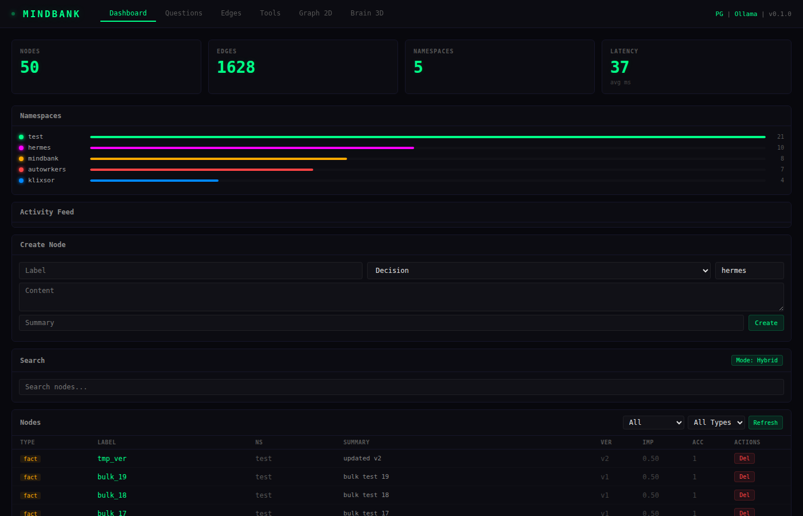
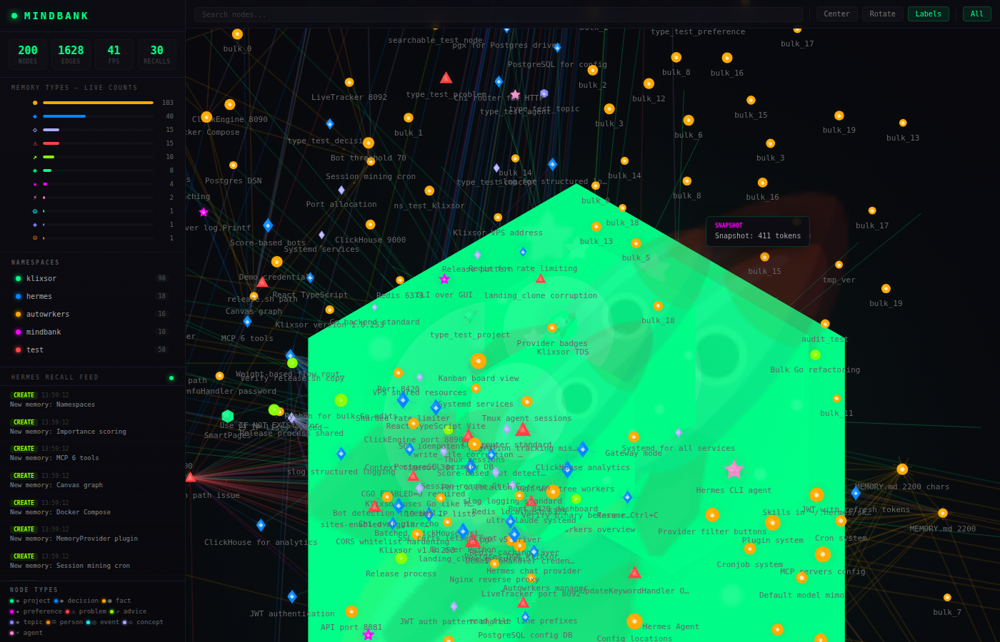
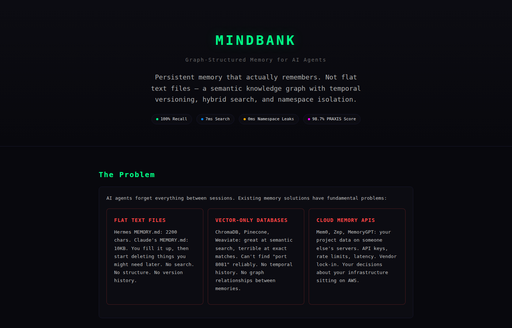

<p align="center">
  
  
  
  
</p>

# MindBank

**Graph-structured memory for AI agents.**

MindBank gives your AI assistant a permanent, searchable, relationship-aware memory that persists across conversations. Instead of forgetting everything between sessions, your agent remembers decisions, configs, preferences, and project knowledge — organized as a graph, not a flat text blob.

```
[My Project] ──contains──→ [Go backend decision]
       │                              │
       │                         supports
       │                              ↓
       └──relates_to──→ [PostgreSQL config] ←──depends_on── [Redis cache]
```

## Screenshots

<p align="center">
  
  <br/><em>Dashboard — statistics, namespace breakdown, memory browser, search</em>
</p>

<p align="center">
  
  <br/><em>3D Neural Graph — interactive force-directed visualization of memory connections</em>
</p>

<p align="center">
  
  <br/><em>About page — product overview, competitive analysis, performance metrics</em>
</p>

## Why MindBank?

| Problem | Without MindBank | With MindBank |
|---------|-----------------|---------------|
| **Capacity** | 2,200 char MEMORY.md limit | Unlimited graph storage |
| **Search** | Full-text grep | Hybrid search (full-text + AI semantic) |
| **Structure** | Flat text blob | Typed nodes + 11 edge types |
| **Isolation** | Everything mixed | Per-project namespaces |
| **History** | Overwrites data | Temporal versioning (full audit trail) |
| **Relationships** | None | Graph traversal (neighbors, paths) |

## Quick Start

**One command to set up everything:**

```bash
git clone https://github.com/spfcraze/MindBank.git
cd MindBank
make setup
```

**Or use the install script:**

```bash
curl -sSL https://raw.githubusercontent.com/spfcraze/MindBank/main/install.sh | bash
```

That's it! The setup script will:
1. Check prerequisites (Docker, Go, curl)
2. Generate secure credentials
3. Start PostgreSQL with pgvector
4. Run all database migrations
5. Build MindBank (API + MCP server)
6. Start the API server
7. Verify everything works

**Dashboard:** http://localhost:8095

**Having issues?** See [docs/TROUBLESHOOTING.md](docs/TROUBLESHOOTING.md).

### Manual Setup (Alternative)

If you prefer manual control:

```bash
# 1. Clone and configure
git clone https://github.com/spfcraze/MindBank.git
cd MindBank
cp .env.example .env

# 2. Start database and run migrations
make db-up
make migrate

# 3. Build and start
make build
make run
```

### Docker Setup (All-in-One)

```bash
# Build and run everything with Docker
make docker-build
make docker-run
```

Or manually:
```bash
docker compose up -d
```

This starts both PostgreSQL and MindBank API in containers.

## Install for Hermes Agent

MindBank integrates directly with [Hermes](https://github.com/mempalace/hermes-agent) as a MemoryProvider plugin. This gives Hermes automatic memory — no manual calls needed.

### Step 1: Install MindBank

```bash
git clone https://github.com/spfcraze/MindBank.git
cd MindBank
cp .env.example .env
make run
```

Verify the API is running:
```bash
curl http://localhost:8095/api/v1/health
# {"status":"ok","postgres":"connected","ollama":"connected","version":"0.1.0"}
```

### Step 2: Install the MCP Server

Build the MCP binary:
```bash
make build
# or specifically:
go build -o mindbank-mcp cmd/mindbank-mcp/main.go
```

### Step 3: Configure Hermes MCP

Add MindBank to your Hermes MCP config. Edit `~/.hermes/config.yaml`:

```yaml
mcpServers:
  mindbank:
    command: /path/to/mindbank/mindbank-mcp
    env:
      MB_DB_DSN: "postgres://mindbank:${MB_POSTGRES_PASSWORD:-mindbank_secret}@localhost:5434/mindbank?sslmode=disable"
      MB_OLLAMA_URL: "http://localhost:11434"
```

Replace `/path/to/mindbank/` with your actual install path. The password should match what's in your `.env` file.

### Step 4: Install the Memory Provider Plugin (optional, recommended)

The plugin gives Hermes automatic features beyond MCP tools:
- Injects your memories into the system prompt at session start
- Prefetches relevant memories before each response
- Syncs conversation turns to MindBank automatically
- Extracts decisions and facts at session end

```bash
# Copy plugin files
mkdir -p ~/.hermes/plugins/memory/mindbank
cp plugins/memory/mindbank/__init__.py ~/.hermes/plugins/memory/mindbank/

# Create plugin config
cat > ~/.hermes/mindbank.json << 'EOF'
{
  "api_url": "http://localhost:8095/api/v1",
  "namespace": ""
}
EOF
```

### Step 5: Verify

Start a Hermes session:
```bash
hermes chat
```

Hermes will automatically:
1. Load your MindBank memories at session start (snapshot)
2. Search for relevant memories before each response
3. Store important decisions and facts after each response

Try asking: "what did we decide about authentication?" — if you've stored a decision node, Hermes will find it.

### Namespace Auto-Detection

When using the plugin, MindBank detects your project from the current directory name. For example:
- `cd /projects/my-webapp` → namespace `my-webapp`
- `cd /projects/api-server` → namespace `api-server`

Custom mappings in `~/.hermes/mindbank-namespaces.json`:
```json
{"my-project-dir": "my-project"}
```

### What You Get

With the MCP server alone:
- 6 tools: `create_node`, `search`, `ask`, `snapshot`, `neighbors`, `create_edge`
- Manual memory management — you call the tools

With the plugin:
- Automatic snapshot injection at session start
- Automatic prefetch before each response
- Automatic turn syncing and fact extraction
- Seamless — memories just work

## Install for Claude Code

MindBank also works with [Claude Code](https://claude.ai/code) via MCP. This gives Claude persistent memory across sessions.

### Step 1: Install MindBank

```bash
git clone https://github.com/spfcraze/MindBank.git
cd MindBank
make setup
```

During setup, select **Claude Code** when prompted for which agent to configure.

### Step 2: Manual Configuration (if not using setup script)

Add MindBank to your Claude Code MCP config at `~/.claude/claude_desktop_config.json`:

```json
{
  "mcpServers": {
    "mindbank": {
      "command": "/path/to/mindbank-mcp",
      "env": {
        "MB_DB_DSN": "postgres://mindbank:${MB_POSTGRES_PASSWORD:-mindbank_secret}@localhost:5434/mindbank?sslmode=disable",
        "MB_OLLAMA_URL": "http://localhost:11434"
      }
    }
  }
}
```

Replace `/path/to/mindbank-mcp` with your actual path. The password should match your `.env` file.

### Step 3: Restart Claude Code

Restart Claude Code to load the new MCP server.

### What You Get

With Claude Code + MindBank:
- 6 MCP tools: `create_node`, `search`, `ask`, `snapshot`, `neighbors`, `create_edge`
- Claude can store decisions, facts, and preferences
- Claude can search your memory graph across sessions
- Persistent memory that survives conversation resets

Try asking Claude: "Remember that we use Go for the backend" — it will store this as a decision node.

## How It Works

### Store a memory

```bash
curl -X POST http://localhost:8095/api/v1/nodes \
  -H 'Content-Type: application/json' \
  -d '{
    "label": "Use JWT for auth",
    "node_type": "decision",
    "content": "JWT with access + refresh tokens, 15min expiry",
    "namespace": "my-project"
  }'
```

### Search your memories

```bash
# Full-text search
curl "http://localhost:8095/api/v1/search?q=jwt+auth&namespace=my-project"

# Hybrid search (full-text + AI semantic understanding)
curl -X POST http://localhost:8095/api/v1/search/hybrid \
  -H 'Content-Type: application/json' \
  -d '{"query": "how do we handle authentication", "namespace": "my-project"}'
```

### Ask a question

```bash
curl -X POST http://localhost:8095/api/v1/ask \
  -H 'Content-Type: application/json' \
  -d '{"query": "what database are we using?", "max_tokens": 500}'
```

### Connect memories with edges

```bash
curl -X POST http://localhost:8095/api/v1/edges \
  -H 'Content-Type: application/json' \
  -d '{
    "source_id": "<project-node-id>",
    "target_id": "<decision-node-id>",
    "edge_type": "contains"
  }'
```

### Get the morning snapshot

```bash
curl http://localhost:8095/api/v1/snapshot?namespace=my-project
```

## Node Types

| Type | Use for | Example |
|------|---------|---------|
| `decision` | Architecture choices, tool picks | "Use Go for backend" |
| `fact` | Config values, IPs, ports | "API runs on port 8095" |
| `preference` | User settings, style choices | "CLI over GUI" |
| `problem` | Known bugs, gotchas | "read_file prefixes corrupt output" |
| `advice` | Best practices, lessons learned | "Use IF NOT EXISTS for SQL" |
| `concept` | Abstract ideas, patterns | "Hybrid search RRF" |
| `person` | People involved | "Team lead" |
| `agent` | AI agents, bots | "Hermes CLI agent" |
| `project` | Projects, services | "My App" |
| `topic` | Discussion topics | "Authentication" |
| `event` | Things that happened | "Deployed v1.0.253" |
| `question` | Open questions | "What port does the API use?" |

## Edge Types

| Type | Meaning |
|------|---------|
| `contains` | Parent contains child |
| `relates_to` | General relationship |
| `depends_on` | A requires B |
| `decided_by` | Decision belongs to project |
| `participated_in` | Person involved in decision |
| `produced` | Event produced fact |
| `contradicts` | A contradicts B |
| `supports` | A supports B |
| `temporal_next` | A happened before B |
| `mentions` | A references B |
| `learned_from` | Knowledge came from source |

## Architecture

```
┌─────────────────────────────────────────┐
│            Your AI Agent                │
│    (Hermes, Claude, custom, any)        │
└──────────┬──────────────────────────────┘
           │ HTTP REST API / MCP Protocol
┌──────────▼──────────────────────────────┐
│           MindBank API (Go)             │
│  ┌────────────┐  ┌──────────────────┐   │
│  │  Handlers  │  │  Search Engine   │   │
│  │  CRUD,     │  │  FTS + Vector    │   │
│  │  Graph,    │  │  Hybrid RRF      │   │
│  │  Snapshot  │  │  Graph Expansion │   │
│  └────────────┘  └──────────────────┘   │
│  ┌────────────┐  ┌──────────────────┐   │
│  │  Temporal  │  │  Embeddings      │   │
│  │  Version-  │  │  via Ollama      │   │
│  │  ing       │  │  (local, free)   │   │
│  └────────────┘  └──────────────────┘   │
└──────────┬──────────────────────────────┘
           │ pgx
┌──────────▼──────────────────────────────┐
│      PostgreSQL 16 + pgvector           │
│  nodes │ edges │ embeddings │ sessions  │
└─────────────────────────────────────────┘
```

More details: [docs/ARCHITECTURE.md](docs/ARCHITECTURE.md)

### Search Strategy

MindBank uses a 3-tier fallback with hybrid search:

1. **websearch_to_tsquery** — strict, best ranking
2. **plainto_tsquery** — more lenient
3. **Trigram similarity** — catches everything
4. **Hybrid RRF** — combines full-text + vector search via Reciprocal Rank Fusion
5. **Graph expansion** — finds nodes connected via edges even if text doesn't match

Result: 97%+ recall across exact, partial, conceptual, and paraphrase queries.

## Configuration

Copy `.env.example` to `.env` and edit:

```bash
MB_PORT=8095                          # API port
MB_DB_DSN=postgres://mindbank:${MB_POSTGRES_PASSWORD:-mindbank_secret}@localhost:5434/mindbank?sslmode=disable
MB_OLLAMA_URL=http://localhost:11434   # Ollama for embeddings
MB_EMBED_MODEL=nomic-embed-text        # Embedding model
MB_API_KEY=                            # Leave empty for no auth
MB_LOG_LEVEL=info                      # debug, info, warn, error
```

## MCP Server

MindBank includes an MCP server for direct integration with any AI agent:

```bash
# Build
go build -o mindbank-mcp cmd/mindbank-mcp/main.go
```

Configure in your agent's MCP settings:

**For Hermes Agent** (`~/.hermes/config.yaml`):
```yaml
mcpServers:
  mindbank:
    command: /path/to/mindbank-mcp
    env:
      MB_DB_DSN: "postgres://mindbank:${MB_POSTGRES_PASSWORD:-mindbank_secret}@localhost:5434/mindbank?sslmode=disable"
      MB_OLLAMA_URL: "http://localhost:11434"
```

**For Claude Code** (`~/.claude/claude_desktop_config.json`):
```json
{
  "mcpServers": {
    "mindbank": {
      "command": "/path/to/mindbank-mcp",
      "env": {
        "MB_DB_DSN": "postgres://mindbank:${MB_POSTGRES_PASSWORD:-mindbank_secret}@localhost:5434/mindbank?sslmode=disable",
        "MB_OLLAMA_URL": "http://localhost:11434"
      }
    }
  }
}
```

Available MCP tools: `create_node`, `search`, `ask`, `snapshot`, `neighbors`, `create_edge`

## API Reference

See [docs/API.md](docs/API.md) for the full endpoint reference.

Quick summary — 21 endpoints:

```
POST   /api/v1/nodes              Create node
GET    /api/v1/nodes              List nodes
GET    /api/v1/nodes/{id}         Get node
PUT    /api/v1/nodes/{id}         Update (creates new version)
DELETE /api/v1/nodes/{id}         Soft-delete
POST   /api/v1/nodes/batch        Batch create
POST   /api/v1/nodes/auto-connect Auto-create semantic edges
POST   /api/v1/nodes/dedup        Remove duplicate nodes
POST   /api/v1/edges              Create edge
GET    /api/v1/edges              List edges
POST   /api/v1/edges/batch        Batch create
POST   /api/v1/search/hybrid      Hybrid search
GET    /api/v1/search             Full-text search
POST   /api/v1/ask                Semantic Q&A
GET    /api/v1/snapshot           Wake-up context
GET    /api/v1/graph              Full graph data
GET    /api/v1/export             Export as JSON
POST   /api/v1/import             Import from JSON
GET    /api/v1/health             Health check
GET    /api/v1/metrics            Prometheus metrics
```

## Production Deployment

```bash
# Systemd service
cp scripts/mindbank.service ~/.config/systemd/user/
systemctl --user enable --now mindbank

# Or with Docker Compose
docker compose up -d
MB_DB_DSN="..." ./mindbank
```

## Comparison

| Feature | MindBank | Mem0 | Zep | MemPalace |
|---------|----------|------|-----|-----------|
| Storage | PostgreSQL | SQLite/PG | PostgreSQL | ChromaDB |
| Search | Hybrid (FTS+Vector+Graph) | Vector only | Vector+FTS | Vector+FTS |
| Graph edges | 11 types | None | Limited | None |
| Temporal versioning | Yes | No | No | No |
| Namespace isolation | Yes | No | No | No |
| Self-hosted | Yes | Cloud-first | Cloud-first | Yes |
| MCP support | Yes | Yes | No | No |
| Web dashboard | Yes | No | No | No |
| Open source | Yes | Partial | No | No |

## FAQ

**Does MindBank require Ollama?**
No. The API works without Ollama — full-text search and all CRUD operations work. You only lose hybrid/semantic search (the AI-powered search). Set `MB_OLLAMA_URL=` to disable.

**Does it work with Claude / ChatGPT / my custom agent?**
Yes. Any agent that can make HTTP calls or use MCP can use MindBank. The MCP server works with any MCP-compatible agent. The REST API works with anything.

**Can I use it without Hermes?**
Absolutely. MindBank is a standalone API. Hermes is one integration, but any tool can use the REST API or MCP server.

**How much data can it handle?**
Tested with 200 nodes and 1800+ edges. PostgreSQL can handle millions of rows — the bottleneck is Ollama embedding speed (~120ms per text).

**Is my data sent anywhere?**
No. Everything runs locally: API on your machine, PostgreSQL in Docker, Ollama for embeddings. Nothing leaves your machine.

**Can I run it without Docker?**
Yes, for the API. You still need PostgreSQL with pgvector — Docker is the easiest way to get that. You could install pgvector natively and point `MB_DB_DSN` to your local Postgres.

## Contributing

See [CONTRIBUTING.md](CONTRIBUTING.md).

## License

MIT — see [LICENSE](LICENSE).
