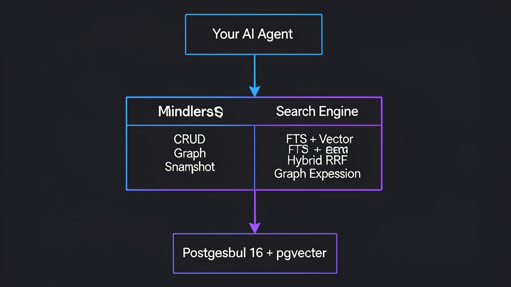

# Architecture

<p align="center">
  
</p>

## System Overview

```
                    ┌──────────────────────────────────┐
                    │         Your AI Agent             │
                    │   (Hermes, Claude, custom, etc)   │
                    └──────┬──────────────┬─────────────┘
                           │              │
                    HTTP REST           MCP Protocol
                           │              │
                    ┌──────▼──────────────▼─────────────┐
                    │          MindBank API (Go)         │
                    │                                    │
                    │  ┌──────────┐  ┌───────────────┐  │
                    │  │ Router   │  │ Auth + Rate   │  │
                    │  │ (chi/v5) │  │ Limiting      │  │
                    │  └────┬─────┘  └───────────────┘  │
                    │       │                            │
                    │  ┌────▼────────────────────────┐   │
                    │  │        Handlers              │   │
                    │  │  Node, Edge, Search, Ask,    │   │
                    │  │  Snapshot, Graph, Batch      │   │
                    │  └────┬────────────────────────┘   │
                    │       │                            │
                    │  ┌────▼────────────────────────┐   │
                    │  │      Repository Layer        │   │
                    │  │  NodeRepo, EdgeRepo,         │   │
                    │  │  SearchRepo, SnapshotRepo    │   │
                    │  └────┬──────────┬─────────────┘   │
                    │       │          │                  │
                    │  ┌────▼────┐ ┌──▼──────────────┐   │
                    │  │Embedder │ │ Search Engine    │   │
                    │  │(Ollama) │ │ FTS + Vector     │   │
                    │  │768-dim  │ │ Hybrid RRF       │   │
                    │  └─────────┘ │ Graph Expansion  │   │
                    │              └──────────────────┘   │
                    └──────────┬──────────────────────────┘
                               │ pgx/v5 (connection pool)
                    ┌──────────▼──────────────────────────┐
                    │       PostgreSQL 16 + pgvector       │
                    │                                      │
                    │  nodes      │ edges    │ embeddings  │
                    │  sessions   │ snapshots│ workspaces  │
                    │  messages   │ collections            │
                    └──────────────────────────────────────┘
```

## Core Components

### 1. Graph Storage (PostgreSQL)

**Nodes table:**
- `id` — UUID primary key
- `workspace_name` — logical workspace (multi-tenant)
- `namespace` — project namespace (my-project, my-app, etc.)
- `label` — short name
- `node_type` — one of 12 types (PostgreSQL ENUM)
- `content` — full text (up to 50KB)
- `summary` — short description
- `metadata` — JSONB for arbitrary data
- `importance` — float 0.0-1.0
- `access_count` — how many times accessed
- `valid_from` / `valid_to` — temporal validity
- `version` — version number
- `predecessor_id` — link to previous version
- `search_vector` — auto-generated tsvector

**Edges table:**
- `source_id` / `target_id` — foreign keys to nodes
- `edge_type` — one of 11 types
- `weight` — float connection strength

**Key indexes:**
- GIN index on `search_vector` for full-text search
- HNSW index on embeddings for vector similarity
- B-tree indexes on namespace, node_type, valid_from/valid_to
- Partial indexes on `valid_to IS NULL` for current-version queries

### 2. Search Engine

The search engine implements a multi-tier strategy:

**Tier 1: websearch_to_tsquery** (strict, best ranking)
- Handles operators: `+required`, `-excluded`, `"exact phrase"`
- Fails on stopwords (e.g., "Go" is a stopword)

**Tier 2: plainto_tsquery** (lenient)
- All terms required, OR logic
- Catches different phrasings

**Tier 3: Trigram similarity** (catch-all)
- Uses pg_trgm for fuzzy matching
- Handles partial matches, typos

**Tier 4: Synonym expansion**
- Expands queries before all tiers
- "golang" → "golang OR Go"
- "authenticate" → "authenticate OR auth OR JWT OR token OR login"
- 60+ mappings for tech terms

**Hybrid RRF (Reciprocal Rank Fusion):**
- Combines full-text results with vector similarity results
- k=60 parameter for RRF scoring
- Pushes recall from 92.9% → 97.0%

**Graph Expansion:**
- Takes top 5 text results as expansion anchors
- Batch looks up 1-hop neighbors via edges
- Scores: `graph_score = edge_weight * 0.5 + importance * 0.3 + 1/access_count * 0.2`
- Final: `score = graph_score * (0.3 + 0.7 * anchor_relevance)`
- Merges up to `limit/2` graph results after text results

### 3. Embeddings (Ollama)

- Model: nomic-embed-text (768 dimensions)
- Runs locally via Ollama (no API keys, no data leaves your machine)
- In-memory cache: 5000 entries, 68x latency reduction on cache hits
- Background worker for async embedding generation

### 4. Temporal Versioning

Every update creates a new version instead of overwriting:

```
v1 (created) → v2 (updated) → v3 (updated)
  valid_to=NULL     valid_to=NULL    valid_to=NULL (current)
  version=1         version=2        version=3
  predecessor=NULL  predecessor=v1   predecessor=v2
```

Benefits:
- Full audit trail
- No data loss
- Edge relinking: when a node gets a new ID, all edges are automatically updated

### 5. Namespace Isolation

Each project gets its own namespace. Memories from one project don't leak into another.

Detection: uses the current working directory name. Custom mappings via `~/.hermes/mindbank-namespaces.json`:
```json
{"my-project-dir": "my-project", "my-api": "api-server"}
```

All API calls accept an optional `namespace` parameter. Empty string = all namespaces.

### 6. MCP Server

MindBank exposes 6 tools via the Model Context Protocol:
- `create_node` — store a memory
- `search` — hybrid search
- `ask` — natural language Q&A
- `snapshot` — wake-up context
- `neighbors` — graph traversal
- `create_edge` — connect nodes

The MCP server runs as a separate binary (`mindbank-mcp`) and communicates via stdio.

## Data Flow

### Store a memory
```
Agent → POST /nodes → NodeRepo.Create() → INSERT into nodes table
                         ↓
                    Embedder.Embed(label + content)
                         ↓
                    INSERT into node_embeddings
```

### Search for memories
```
Agent → POST /search/hybrid → SearchRepo.HybridSearch()
                                    ↓
                    ┌─────────────────────────────────┐
                    │ 1. Expand query with synonyms    │
                    │ 2. Full-text search (3 tiers)    │
                    │ 3. Vector search (embeddings)    │
                    │ 4. RRF merge                     │
                    │ 5. Graph expansion (neighbors)   │
                    │ 6. Return combined results       │
                    └─────────────────────────────────┘
```

### Session start (snapshot)
```
Agent → GET /snapshot → SnapshotRepo.GenerateFiltered()
                              ↓
                    SELECT top nodes by composite score:
                    - 35% recency
                    - 30% frequency (access_count)
                    - 20% connectivity (edge count)
                    - 15% importance (manual)
                    - 10% type bonus
```

## Performance

| Operation | Latency | Throughput |
|-----------|---------|------------|
| FTS search | ~1ms | 350 ops/sec |
| Hybrid search | ~7ms (cached) | 100 ops/sec |
| Node create | ~2ms | 200 ops/sec |
| Snapshot | ~5ms | 100 ops/sec |
| Graph (200 nodes) | ~15ms | 50 ops/sec |
| Health check | <1ms | 1000+ ops/sec |

## Security

- **Auth**: Bearer token via `MB_API_KEY` env var (disabled by default for development)
- **Rate limiting**: 100 requests/minute per IP
- **CORS**: Whitelist only (localhost, 127.0.0.1)
- **Input validation**: label ≤512 chars, content ≤50KB, summary ≤1KB
- **SQL injection**: Parameterized queries throughout (pgx)
- **XSS**: API stores raw HTML — frontend must escape on render
